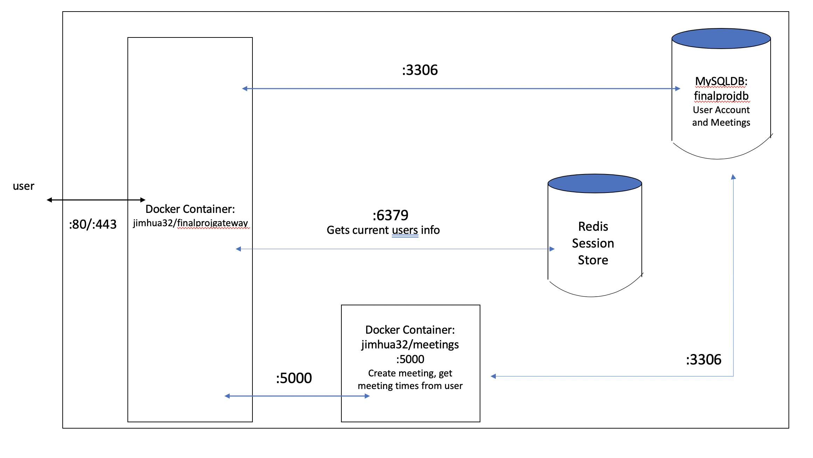
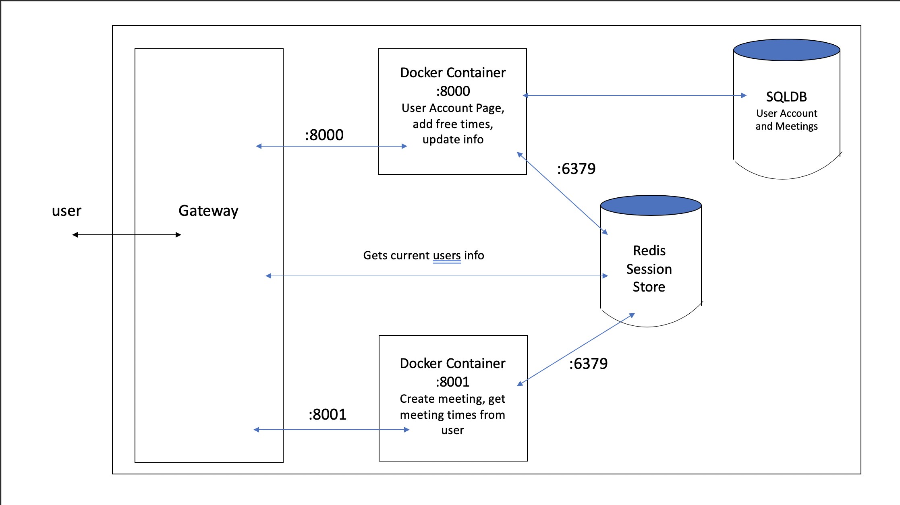
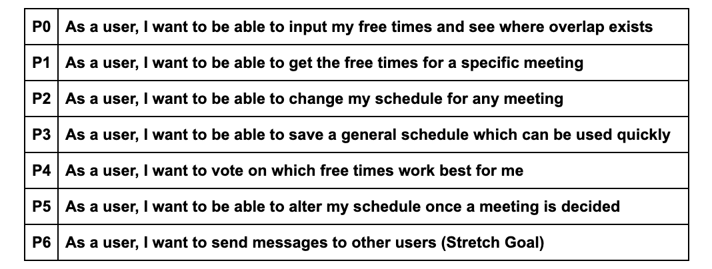
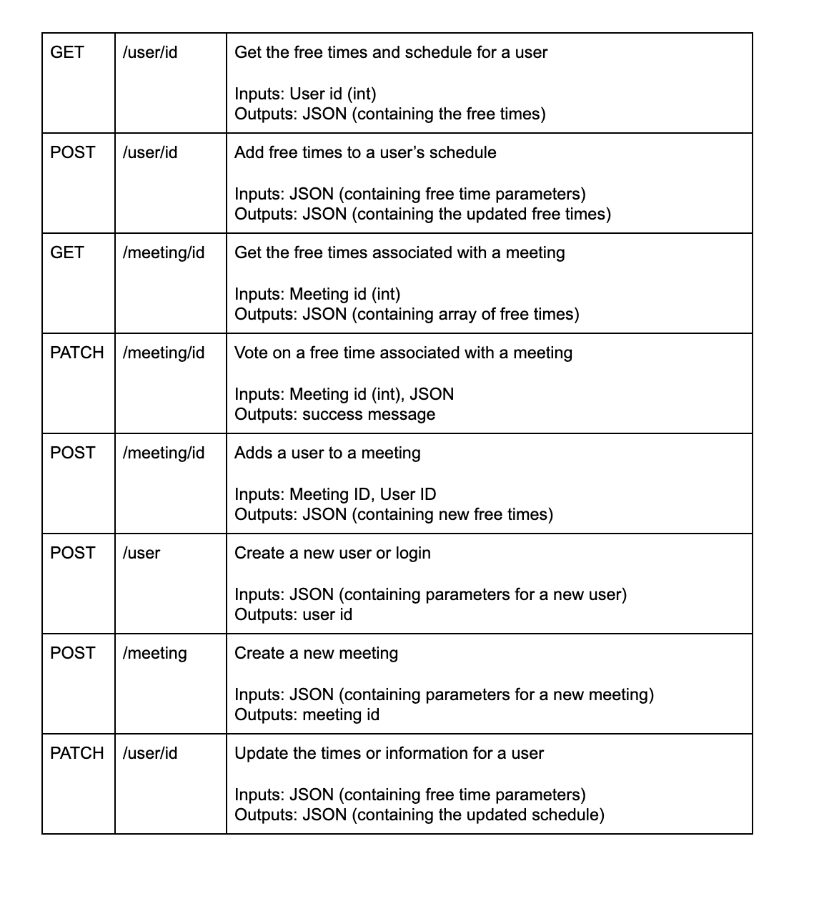

# Project Proposal
by Jeremiah Cheng, Andrew Chan, Anna Zhou, Jimmy Hua
# Project Description
This application is intended to be used by people who need to easily figure out when other people in a group are free. This could be used for scheduling meetings, but also for any sort of group activity. Whether it be grabbing coffee, having a party or planning a company meeting, this app will provide the capability for people to easily find out when every person is free. Realistically, this will be used most by students and young adults, and potentially working professionals for planning activities. This application is useful because it allows for users to log in and save their schedule information and allows for the planning of multiple events. This has more functionality than current alternatives such as When2Meet which only has temporary meetings. It should make planning events and get-togethers even easier and much more efficient. We as developers would like to build this application as it will give us more practice in authenticating users and allowing for them to interact with other users. It should present a valuable experience in furthering our knowledge of Golang and its capabilities alongside Docker and associated Databases.

# Technical Description

<!--  -->
<!--  -->
| Priority | Description |
| -------- | ----------- |
| P0 | As a user, I want to be able to input my free times and see where overlap exists |
| P1 | As a user, I want to be able to get the free times for a specific meeting |
| P2 | As a user, I want to be able to change my schedule |
| P3 | As a user, I want to be able to save a general schedule, which can be used quickly |
| P4 | As a user, I want to be able to alter my schedule once a meeting is decided |

# Endpoints
* `GET`; `/user/`: Gets the free times, schedule, and meetings for a user
    * Inputs: None
    * Outputs: `application/json`
    * Header: 
        * Authentication: bearer token
    * Response Codes:
        * `200`: `application/json` success
        * `400`: UserID does not exist
        * `401`: User not authenticated
        * `405`: Wrong Method
* `PATCH`; `/user/`: Adds free time to user's schedule
    * Inputs: `application/json`
    * Outputs: `application/json`
    * Header: 
        * Authentication: bearer token
        * Content-Type: `application/json`
    * Response Codes:
        * `201`: `application/json` success
        * `400`: UserID does not exist
        * `405`: Wrong Method
        * `415`: Wrong content type
* `GET`; `/meeting/id`: Gets the free times, users, meeting description, meeting title associated with a meeting
    * Inputs: Meeting ID (int)
    * Outputs: `application/json`
    * Header: 
        * Authentication: bearer token
    * Response Codes:
        * `200`: `application/json` success
        * `401`: User not authenticated or User doesn't belong in meeting
        * `405`: Wrong Method
* `POST`; `/meeting/id`: Adds users to a meeting
    * Inputs: Meeting ID, User ID
    * Outputs: `text`: success message
    * Header: 
        * Authentication: bearer token
        * Content-Type: `application/json`
    * Response Codes:
        * `201`: `application/json` success
        * `401`: User not authenticated or User is not the creator
        * `405`: Wrong Method
        * `415`: Wrong content header
* `POST`; `/users`: creates a new user
    * Inputs: `application/json`
    * Outputs: User ID
    * Header: 
        * Content-Type: `application/json`
    * Response Codes:
        * `200`: success
        * `405`: Wrong Method
        * `415`: Content header is not json
* `POST`; `/sessions`: Logs in existing user
    * Inputs: `application/json`
    * Outputs: `text`: success
    * Header: 
        * Content-Type: `application/json`
    * Response Codes:
        * `200`: success
        * `405`: Wrong Method
        * `415`: Content Header is not JSON
* `POST`; `/meeting`: create a new meeting
    * Inputs: `application/json`
    * Outputs: Meeting ID
    * Header: 
        * Authentication: bearer token
        * Content-Type: `application/json`
    * Response Codes:
        * `200`: success
        * `400`: Existing meeting
        * `401`: User not authenticated
        * `405`: Wrong Method


## Models: 

### User Fields:
`user`: represents any user in our user table
```
{
  "UserID": "id",
  "Email": "email",
  "PassHash": "password",
  "FirstName": "fname",
  "LastName": "lname"
}
```

`login`: login credentials will be 
```
{
	"Email": "test@example.com",
	"Password": "test123"
}
```

`new user`: will be sent as:
```
    {
	"Email": "test@test.com",
	"Password": "password",
	"PasswordConf": "password",
	"FirstName": "first",
	"LastName": "last"
}
```

`meeting`: will be sent as:
```
    {
        "MeetingName": "new meeting",
        "MeetingDesc": "description"
    }
```

### Meeting Fields:
Meeting ID,
Meeting Name,
User IDs (array),
Free Times (array), calculated from users’ free times


The schedule will be constructed based on the free times



### original diagram
